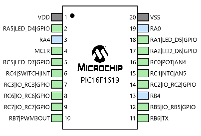

PIC16F1619 PWM fan controller utilizing one NTC resistor as sensor.

It alternates between two modes, mode1 is using simple hysteresis, mode2 is trying to maintain an exact balance by looking at temperature delta movement.

Pin 10: Fan PWM output  
Pin 15: NTC voltage divider input

NTC is on high side with 10k on low side.
